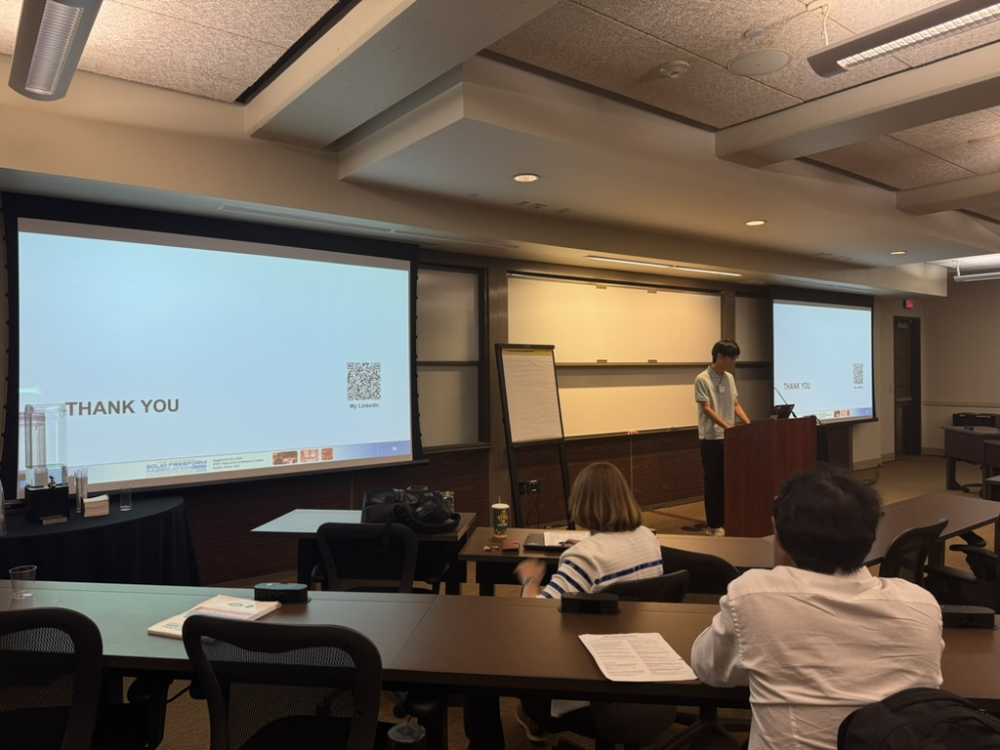

<!-- {}
Click on the **Slides** button above to view the built-in slides feature.
{} -->

<!-- Slides can be added in a few ways:

- **Create** slides using Hugo Blox Builder's [_Slides_](https://docs.hugoblox.com/reference/content-types/) feature and link using `slides` parameter in the front matter of the talk file
- **Upload** an existing slide deck to `static/` and link using `url_slides` parameter in the front matter of the talk file
- **Embed** your slides (e.g. Google Slides) or presentation video on this page using [shortcodes](https://docs.hugoblox.com/reference/markdown/).

Further event details, including [page elements](https://docs.hugoblox.com/reference/markdown/) such as image galleries, can be added to the body of this page. -->
