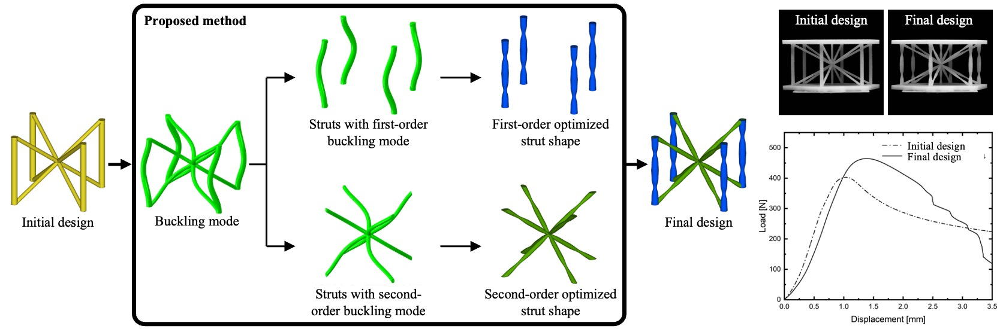

This project focuses on analysis and optimization of thin struts in lattice core sandwich panels. Lightweight lattice cores are easy to fail by buckling due to its long slenderness ratio. We optimized thin struts in lattice core sandwich structures to improve buckling resistance. The key innovation was an efficient, bottom-up methodology that avoids computationally expensive optimizations on entire structures.

# Methodology & Strut Optimization
We developed an efficient, bottom-up design methodology to improve the buckling strength of lattice core sandwich structures. The strategy involved first identifying the optimal, non-uniform cross-sections of individual struts by maximizing their buckling eigenvalues using a Python-Abaqus scripted workflow. Strut profiles were modeled with a Fourier Series (FS) representation, and a key finding was that the optimal shapes are proportionally scalable, creating a reusable library of high-performance struts.

# Lattice Design & Simulation
We designed four distinct non-uniform lattice cores (Kagome, BCC, BCCZ, and Six-fold) by strategically replacing uniform struts with pre-optimized shapes based on their specific, identified buckling modes (first or second-order). Comprehensive eigenvalue and nonlinear post-buckling (Riks method) analyses in Abaqus confirmed these designs achieved a 16-21% improvement in critical buckling load over uniform counterparts.

# Experimental Validation
We validated the designs by fabricating BCC and Six-fold specimens from Nylon 12 powder using Selective Laser Sintering (SLS). Quasi-static compression tests demonstrated a measured compressive strength improvement of 18.77% for the BCC structure and 10.00% for the Six-fold. We also developed a high-fidelity nonlinear FE model that incorporated material plasticity and a measured 80µm surface roughness layer, achieving excellent agreement with experimental peak loads and failure mechanisms.

Publications related to this project:
- 10.1080/0305215X.2022.2163239

<!--more-->
