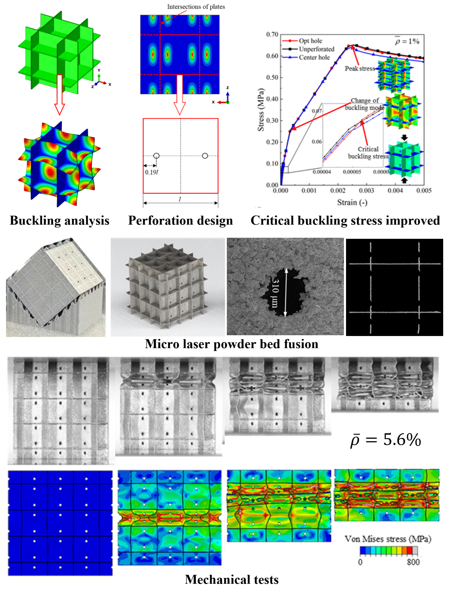

In this project, we developed and validated a novel design methodology to enhance the manufacturability and buckling strength of metallic plate lattices. The core challenge was to introduce micro-holes for powder removal in additive manufacturing without the typical reduction in mechanical performance, particularly against buckling failure in low-density structures.

# Theoretical & Numerical Method Development:
⦁ We established a design framework rooted in a Rayleigh quotient-based theoretical criterion to identify the optimal locations for micro-holes that actively increase the critical buckling load of a plate.
⦁ To implement this, we developed a robust numerical method to evaluate the second-order derivatives of the buckling eigenmode. This was achieved by directly utilizing the shape functions of 8-node second-order shell elements (S8R) within Abaqus.

# Finite Element Analysis & Design Optimization:
⦁ We applied this methodology to design optimized Simple Cubic (SC), Body-Centered Cubic (BCC), and Face-Centered Cubic (FCC) perforated plate lattices.
⦁ Using Abaqus/Standard and Abaqus/Explicit, we performed a comprehensive suite of simulations, including linear eigenvalue buckling on Representative Volume Element (RVE) models with periodic boundary conditions, nonlinear post-buckling analysis incorporating geometric and material nonlinearities, and large-deformation compression simulations on full-scale models.
⦁ Our analysis successfully demonstrated that the optimized designs increased critical buckling stress by up to 15.1% compared to unperforated lattices, while maintaining comparable post-buckling compressive strength.

# Experimental Validation & Characterization: (by our collaborators)
⦁ We fabricated the optimized lattice specimens using μ-LPBF with SS316L powder.
⦁ Through quasi-static compression testing, we experimentally verified that the fabricated lattices exhibit superior mechanical properties.

Publications related to this project:
- 10.1016/j.matdes.2024.113544

<!--more-->
