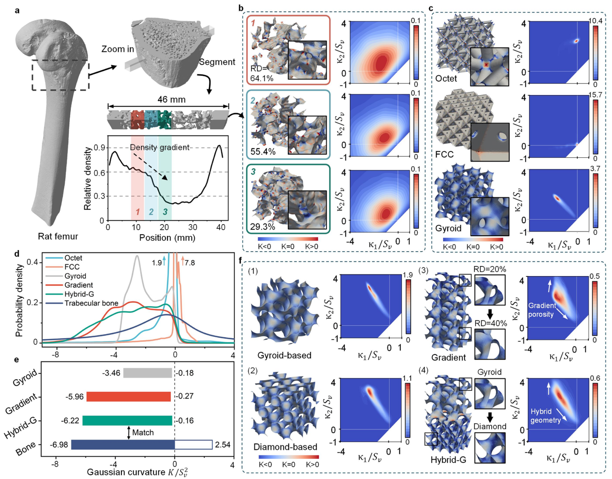

In this project, I engineered advanced bone-mimicking scaffolds by integrating computational geometry analysis with implicit modeling techniques. My primary role was to define and replicate the precise topological features of native bone to create functionally superior lattice structures for tissue engineering.

# Advanced Geometric Analysis:
⦁ Processed high-resolution µCT scans of bone tissue to generate high-fidelity triangle meshes.
⦁ Implemented a multiscale fitting method using the C++ library libigl to calculate principal (κ1​,κ2​) and Gaussian (K) curvatures at each vertex, quantifying the local surface shape.
⦁ Characterized the bone's unique Interface Shape Distribution (ISD) by applying bivariate Kernel Density Estimation (KDE) to the curvature data, providing a quantitative benchmark for bio-mimicry. Our analysis confirmed the prevalence of hyperboloidal (saddle-shaped) surfaces, a key driver for osteogenesis.

# Implicit Modeling & Lattice Design:
⦁ Utilized MATLAB to programmatically generate complex, porous architectures based on Triply Periodic Minimal Surfaces (TPMS), including Gyroid and Diamond structures.
⦁ We developed gradient and hybrid-gradient (hybrid-G) lattices by manipulating the implicit TPMS equations to vary porosity and combine geometries, directly mimicking the heterogeneity found in native bone.
⦁ Engineered all models to match the target average porosity (70%) of the bone specimen by precisely offsetting the implicit surfaces.

# Computational Verification & Visualization:
⦁ Validated our lattice designs by performing the same rigorous curvature analysis on them and comparing their ISDs against the original bone data benchmark.
⦁ Employed Paraview to create detailed 3D visualizations of the Gaussian curvature fields, confirming that hybrid-G design most accurately replicated the critical hyperboloidal characteristics of the target tissue.

Publications related to this project:
- 10.1016/j.mser.2024.100876

<!--more-->
